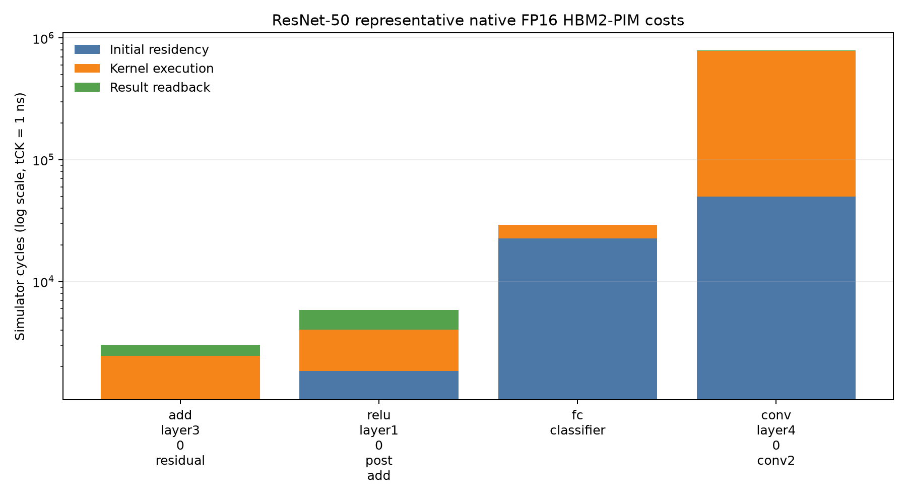
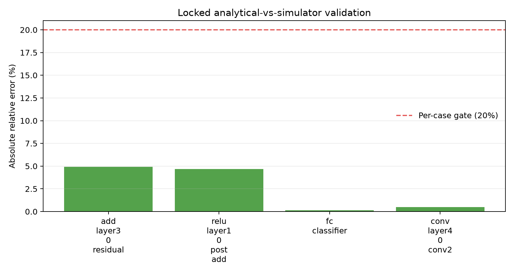

# HBM2-PIM Phase-3 preliminary result

## Headline

PIMSimulator can provide reproducible native dense-FP16 costs for the selected ADD, ReLU, and GEMV mappings at the locked HBM2 configuration. The full-specification audit stops the arm on missing frozen-input provenance and incomplete preregistration, in addition to the end-to-end and representation boundaries. It is not a defensible Stage-1 optimizer input.

## Evidence at a glance

- 30/30 adapter executions passed with zero bit mismatches and exact two-run determinism.
- Native locked workloads span 3,015 cycles (residual ADD), 5,858 (post-add ReLU), 29,273 (classifier GEMV portion), and 790,527 (convolution GEMV portion).
- A development-only analytical fit passed its locked validation: 2.56% MAPE, 4.92% worst-case error.
- Four full transaction traces and all raw stdout, stderr, configurations, commands, binaries, and hashes are preserved.
- The limited local hash guard passed for the feasibility and diagnostic bundles; the full input provenance gate failed because required host/parametric/plan/checkpoint/split manifests were not located.

## Stop decision

No joint optimization was launched. Full provenance and preregistration fail; im2col/packing and host partial-sum reductions lack validated cycle costs; avgpool is unsupported; and dense FP16 is the only validated representation. Therefore exhaustive, placement-first, representation-first, and alternating joint gaps are all `NOT_EVALUATED`, not zero. No coupled-versus-separable regime is claimed.

